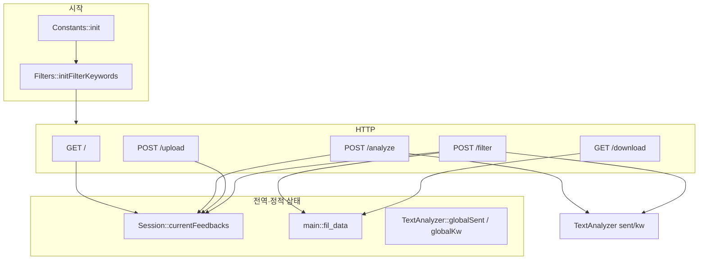

# FeedbackAnalyzer Phase 1 — 레거시 구조 및 문제점 분석

**대상:** `main.cpp`, `TextAnalyzer.h/.cpp`, `Filters.h/.cpp`, `Session.h/.cpp`, `Constants.h/.cpp`, `Logger.h/.cpp`, `UIComponents.h/.cpp`, `FileHandler.h`  
**범위:** 구조·흐름 분석 및 6대 레거시 이슈 진단 (코드 수정·리팩토링 제안 없음)

---

## 1. 아키텍처 개요

단일 프로세스 HTTP 서버(`httplib::Server`)가 폼/CSV 입력 → 세션 벡터 적재 → 감성·키워드 집계·필터 → HTML/CSV 응답을 처리한다. 비즈니스 규칙은 `Constants`/`Filters::S_KEYWORDS`의 키워드 사전과 `containsAny()` 부분 문자열 매칭에 의존한다.



---

## 2. 파일별 역할 및 흐름

### 2.1 `main.cpp`

| 구분 | 내용 |
|------|------|
| **역할** | 진입점, HTTP 라우팅, HTML 렌더링(`renderPage`), 폼/CSV 파싱, 전역 서비스 객체 보유 |
| **전역 객체** | `fil_data`, `textAnalyzer`, `filters`, `fileHandler` (선언만, 미사용) |
| **초기화** | `Constants::init()`, `Filters::initFilterKeywords()` 후 `listen(0.0.0.0, 8080)` |

**라우트 흐름**

| 메서드 | 경로 | 동작 |
|--------|------|------|
| GET | `/` | `Session::initSessionStateUgly()` → `getOldDataFromSession("current_feedbacks")` → 빈 결과로 페이지 |
| POST | `/analyze` | `Session::getCurrentFeedbacks()`에 텍스트 추가 → `textAnalyzer.sent()` / `kw()` → HTML |
| POST | `/upload` | multipart CSV → `feedbacks`에 `Feedback` 적재 (헤더 스킵) |
| POST | `/filter` | `filters.fil()` → 성공 시 **`fil_data`에만** 저장 후 분석·HTML |
| GET | `/download` | **`fil_data`만** CSV로 응답 (UTF-8 BOM) |

**데이터 이원화:** 입력·분석은 `Session::currentFeedbacks`, 다운로드는 `fil_data`. `/filter`를 거치지 않으면 다운로드는 빈 CSV에 가깝다.

**부가 로직:** `urlDecode`, `parseForm`, `parseCsvLine`, `escapeHtml`, `getCurrentTimestamp`가 모두 `main.cpp`에 인라인되어 UI·유틸·서버가 한 파일에 결합되어 있다.

---

### 2.2 `TextAnalyzer.h` / `TextAnalyzer.cpp`

| 구분 | 내용 |
|------|------|
| **역할** | 피드백 목록에 대한 감성 분포(`sent`)·카테고리 키워드 분포(`kw`) 집계 |
| **의존** | `Constants::SENTIMENT_KEYWORDS`, `Constants::CATEGORY_KEYWORDS` |
| **정적 멤버** | `globalSent`, `globalKw` — 매 분석마다 덮어쓰기, 외부에서 읽는 코드는 없음 |

**`sent`:** 각 텍스트에 대해 긍정 키워드 → `긍정`, else 부정 키워드 → `부정`, else `중립`. `map<string,int>` 반환 후 `globalSent` 동기화.

**`kw`:** `CATEGORY_KEYWORDS`의 각 카테고리에 대해 **`"main"` 서브맵만** 사용해 `containsAny`로 카운트. `"main"`이 아닌 서브키(`time`, `physical` 등)는 집계에 미사용.

**`TextAnalyzer.cpp`:** 정적 멤버 정의만 존재.

---

### 2.3 `Filters.h` / `Filters.cpp`

| 구분 | 내용 |
|------|------|
| **역할** | 감성·키워드 UI 필터에 따른 `Feedback` 벡터 필터링 (`fil`) |
| **키워드 소스** | 감성: `Filters::S_KEYWORDS` (`initFilterKeywords`에서 **Constants와 별도** 등록). 키워드: `Constants::CATEGORY_KEYWORDS` |
| **부수 효과** | 필터 결과를 `std::cout`으로 출력 (68–70행) |

**`fil` 2단계**

1. `sFilter != "전체"`: `S_KEYWORDS`로 감성 추론 후 `sFilter`와 일치하는 항목만 `tmpFiltered`.
2. `kFilter != "전체"`: `CATEGORY_KEYWORDS[kFilter]`에서 **`"main"`을 제외한** 서브맵만 검사 (`subEntry.first == "main"` continue). `TextAnalyzer::kw`는 반대로 `"main"`만 사용 → **분석·필터 규칙 불일치**.

---

### 2.4 `Session.h` / `Session.cpp`

| 구분 | 내용 |
|------|------|
| **역할** | 애플리케이션 전역 피드백 목록 보관 (의도상 세션) |
| **실제 사용** | `currentFeedbacks`만 `/`, `/analyze`, `/upload`, `/filter`에서 참조 |
| **미사용** | `internalData`, `filterOptions`, `updateCurrentFeedbacks`, `initSessionStateUgly`의 실질 동작 없음 |

**`getOldDataFromSession(key)`:** `key`와 무관하게 항상 `currentFeedbacks` 참조 반환.

---

### 2.5 `Constants.h` / `Constants.cpp`

| 구분 | 내용 |
|------|------|
| **역할** | 감성·카테고리 키워드 사전의 단일 정적 저장소 (`init()`에서 일괄 등록) |
| **소비자** | `TextAnalyzer` (감성·키워드 집계), `Filters::fil` (키워드 필터만), `UIComponents`와 카테고리명 정합 |

5개 카테고리(배송·품질·가격·서비스·사용성), 각 4개 서브키(`main` + 3개) 구조.

---

### 2.6 `Logger.h` / `Logger.cpp`

| 구분 | 내용 |
|------|------|
| **역할** | 타임스탬프 접두 콘솔 로깅 (`logInfo` / `logWarning` / `logError` / `logDebug`) |
| **정적 상태** | `debugMode` — `Logger.cpp`에서 **`true`로 기본 초기화** (의도 불명) |

`main.cpp`의 예외 처리·업로드·필터 경로에서 호출.

---

### 2.7 `UIComponents.h` / `UIComponents.cpp`

| 구분 | 내용 |
|------|------|
| **역할** | HTML 키워드 `<select>` 옵션용 카테고리 목록 (`getCategories`) |
| **데이터** | `CATS` — `Constants::CATEGORY_KEYWORDS` 키와 동일 5종, **코드상 동기화 보장 없음** (중복 정의) |

---

### 2.8 `FileHandler.h`

| 구분 | 내용 |
|------|------|
| **역할** | 결과 영속화 API (`saveResult`, `save`) |
| **구현** | 표준 출력만 (`saveResult` stub). **`.cpp` 없음**, 헤더 인라인 구현 |
| **연동** | `main.cpp`에 `static FileHandler fileHandler` 선언, **호출 없음**. 실제 다운로드는 `/download`가 `fil_data`로 직접 CSV 생성 |

---

### 2.9 `Feedback.h` (참조)

텍스트 1필드 값 객체. 분석·필터·세션 전 구간에서 전달 단위.

---

## 3. 요청·응답 종단 간 데이터 흐름

```
[브라우저]
   │ POST /analyze (text)
   ▼
Session::currentFeedbacks  ──► TextAnalyzer::sent / kw ──► renderPage
   │ POST /upload (CSV)
   ▼
Session::currentFeedbacks
   │ POST /filter (sentiment, keyword)
   ▼
Filters::fil ──► fil_data (= filtered) ──► sent/kw ──► renderPage
   │ GET /download
   ▼
fil_data ──► CSV (Session과 무관)
```

---

## 4. 6대 레거시 문제점 진단

### ① 축약된 메서드명 (`sent`, `kw`, `fil`, `fil_data`)

| 항목 | 내용 |
|------|------|
| **위치** | `TextAnalyzer::sent`, `kw`; `Filters::fil`; `main.cpp` `fil_data` |
| **현상** | 도메인 의미(감성 분포, 키워드 분포, 필터, 필터 결과 캐시)가 식별자에 드러나지 않음 |
| **영향** | IDE 검색·리뷰·온보딩 비용 증가; `fil`/`fil_data` 혼동으로 다운로드 데이터 소스 오해 가능 |
| **심각도** | **Major** |
| **근거** | 런타임 오류는 아니나, HTTP 핸들러·전역 변수·공개 API 전반에 걸쳐 있어 유지보수 리스크가 누적됨. 특히 `fil_data`는 Session과 병존해 아키텍처 이해를 방해함. |

---

### ② `Constants.cpp` 긍정/부정 키워드 중복 등록

| 항목 | 내용 |
|------|------|
| **위치** | `Constants::init()` — `SENTIMENT_KEYWORDS[u8"긍정"]` 7–12행, `u8"부정"]` 15–20행 |
| **현상** | 동일 UTF-8 문자열 리터럴 블록이 각 감성 벡터 내에서 **연속 두 번** push-back 수준으로 중복 등록됨 (예: `좋아요`, `만족`, `감사` … 세트가 7–10행과 11–12행에 반복; 부정도 15–18행과 19–20행 반복) |
| **영향** | `containsAny`는 `vector` 순회만 하므로 **집계 결과는 동일**할 가능성이 높음. 다만 초기화 버그·복사-붙여넣기 흔적, 메모리·로딩 낭비, 향후 set/가중치 도입 시 잘못된 가정 유발 |
| **심각도** | **Major** |
| **근거** | Phase 1에서 명시된 “등록 버그”에 해당. 기능 침해는 제한적이나 신뢰할 수 있는 설정 소스라는 전제를 훼손하고, `Filters::S_KEYWORDS`와의 이중 유지보수와 합쳐져 설정 드리프트 위험을 키움. |

**부가:** `Filters::initFilterKeywords`는 **별도** 감성 목록을 가지며 항목·개수가 `Constants`와 다름(긍정에 `친절`, `빠르` 등 Filters만 존재). 이는 ②의 중복과 별개로 **감성 판정 불일치** 가능성을 만듦.

---

### ③ `containsAny()` 중복 정의 — 비공개 비즈니스 로직 중복

| 항목 | 내용 |
|------|------|
| **위치** | `TextAnalyzer.h` 13–18행, `Filters.h` 13–18행 — 동일 시그니처·동일 구현 |
| **현상** | 핵심 매칭 규칙(부분 문자열 `find`)이 클래스마다 private static으로 복제 |
| **영향** | 한쪽만 수정 시 **감성 분석(`sent`)과 필터(`fil`) 결과 불일치**; 단위 테스트 시 두 구현을 각각 간접 검증해야 함 |
| **심각도** | **Major** |
| **근거** | 이미 `Constants` vs `Filters::S_KEYWORDS` 이중 사전과 결합되어 드리프트가 실질적이다. 공통 유틸 부재는 레거시 전형적 결합도 상승 요인. |

---

### ④ 전역 상태 남용 — 테스트 불가능 구조

| 항목 | 내용 |
|------|------|
| **위치** | `main.cpp`: `fil_data`, `textAnalyzer`, `filters`, `fileHandler`; `TextAnalyzer::globalSent`, `globalKw`; `Session::currentFeedbacks`, `internalData`, `filterOptions`; `Filters::S_KEYWORDS`; `Constants::SENTIMENT_KEYWORDS`, `CATEGORY_KEYWORDS`; `Logger::debugMode` |
| **현상** | 요청 스코프 없이 프로세스 수명 동안 공유되는 가변 정적/전역 상태. httplib 람다가 모두 이 상태에 직접 접근 |
| **영향** | 병렬 요청·재진입 시 레이스(단일 스레드 서버라도 테스트·확장 시 취약); 테스트 시 상태 리셋·격리 불가; 인스턴스 `TextAnalyzer`/`Filters`가 상태ful static에 의존해 DI·mock 곤란 |
| **심각도** | **Critical** |
| **근거** | Phase 2 리팩토링의 구조적 블로커. `fil_data` vs `Session` 분리는 사용자-visible 버그(필터 없이 다운로드)로 이어질 수 있음. `globalSent`/`globalKw`는 쓰기만 하고 읽지 않아 dead state까지 포함. |

---

### ⑤ 의미 없는 `Session` 설계 — `getOldDataFromSession`의 `key` 무시

| 항목 | 내용 |
|------|------|
| **위치** | `Session::getOldDataFromSession(const std::string& key)` → 항상 `currentFeedbacks` 반환; `initSessionStateUgly()` 빈 구현; `internalData`, `filterOptions` 미참조 |
| **현상** | API는 키 기반 세션 조회를 암시하나 실제는 단일 전역 벡터. `GET /`에서 `"current_feedbacks"` 문자열은 **무의미** |
| **영향** | 호출자가 키로 데이터를 구분한다고 오해; 다중 세션·사용자 확장 불가; dead field로 인한 유지보수 노이즈 |
| **심각도** | **Major** |
| **근거** | 잘못된 추상화는 버그 수정 시 Session을 “고친 것처럼” 보이게 하며, ④의 전역 상태를 이름만 세션으로 감춤. |

---

### ⑥ `FileHandler::saveResult()` 콘솔 출력 stub

| 항목 | 내용 |
|------|------|
| **위치** | `FileHandler.h` 9–13행; `save()` → `saveResult()` 위임 |
| **현상** | 파일 I/O 없이 `"saveResult"` + 건수 + 텍스트 줄단위 `std::cout` |
| **영향** | 도메인상 “저장” 계약 미이행; `main`의 `fileHandler` 미사용으로 **이중 우회** — `/download`는 `FileHandler` 없이 `fil_data` 직렬화 |
| **심각도** | **Major** |
| **근거** | 사용자 기능(다운로드)은 부분적으로 `main`에 재구현되어 있어, `FileHandler`는 dead code에 가깝고 아키텍처 문서·가이드와 실제 경로가 어긋남. 프로덕션 파일 쓰기·경로·에러 처리 부재는 **Warning** 수준의 운영 리스크(현재 경로가 CSV 응답으로 대체됨). |

---

## 5. 심각도 요약

| ID | 문제 | 심각도 | 핵심 근거 |
|----|------|--------|-----------|
| ① | 축약 메서드명·`fil_data` | Major | 가독성·오해; 전역 네이밍과 결합 |
| ② | Constants 감성 키워드 중복 등록 | Major | 설정 신뢰성; Filters와 별도 사전과 드리프트 |
| ③ | `containsAny` 중복 | Major | 분석/필터 로직 분기 위험 |
| ④ | 전역·static 상태 | **Critical** | 테스트·격리·`fil_data`/Session 이원화 |
| ⑤ | Session key 무시·dead API | Major | 거짓 추상화, 확장 불가 |
| ⑥ | FileHandler stub | Major (+ 운영 Warning) | 저장 책임 미구현·미연동 |

---

## 6. 분석 범위 외·참고 관찰 (6대 항목 외)

| 관찰 | 설명 |
|------|------|
| `kw` vs `fil` 카테고리 규칙 | 집계는 `"main"`만, 필터는 `"main"` 제외 서브키만 — 동일 UI 카테고리라도 결과가 어긋날 수 있음 |
| `fileHandler` 미사용 | 선언만 존재, 컴파일은 되나 dead instance |
| HTML in `main.cpp` | UI 변경 시 재컴파일·거대 함수 `renderPage` |
| 감성 키워드 이중 소스 | `Constants::SENTIMENT_KEYWORDS` vs `Filters::S_KEYWORDS` |
| `Logger::debugMode = true` | 기본 디버그 on — 의도 확인 필요 (**Minor**) |

---

## 7. 모듈 의존 관계

```
main.cpp
 ├── httplib (외부)
 ├── Constants ──► (정적 맵)
 ├── Session ──► Feedback
 ├── TextAnalyzer ──► Constants, Feedback
 ├── Filters ──► Constants, Feedback
 ├── FileHandler ──► Feedback (미연결)
 ├── UIComponents
 └── Logger

Feedback.h  ◄── 공통 값 객체
```

---

*문서 생성: Phase 1 레거시 정밀 분석 (코드 변경 없음)*
