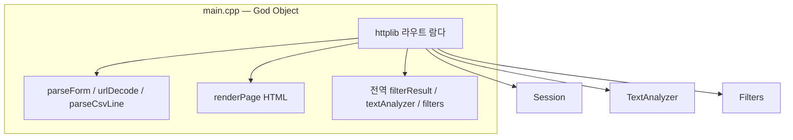
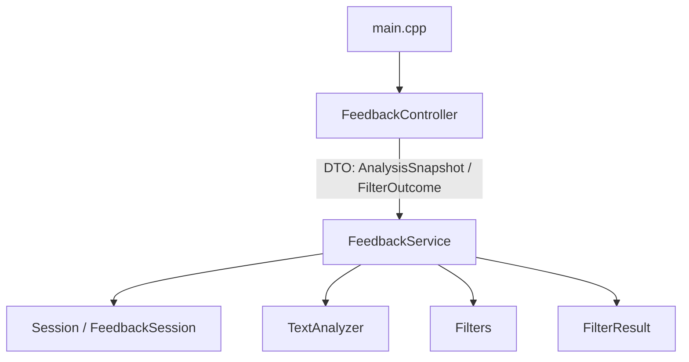

# Phase 5 & 6 — Controller / Service 분리 리팩토링 명세

**기준 문서:** `docs/analysis.md`  
**적용 일자:** 2026-05-22  
**목표:** HTTP 경계(Boundary)와 비즈니스(Application) 책임을 SRP에 맞게 분리

---

## 1. 리팩토링 목표

| 원칙 | 적용 내용 |
|------|-----------|
| **SRP** | `FeedbackController` = HTTP·폼·HTML/CSV 응답만. `FeedbackService` = 세션·분석·필터·다운로드 캐시. |
| **의존 역전** | 컨트롤러는 서비스 인터페이스(구현 클래스)에만 의존. 도메인(`TextAnalyzer`, `Filters`, `Session`)은 서비스가 캡슐화. |
| **얇은 진입점** | `main.cpp`는 초기화·서버 기동만 담당. |

---

## 2. 아키텍처 Before / After

### 2.1 Before (Phase 4 종료 시점)



| 계층 | 파일 | 책임 (혼재) |
|------|------|-------------|
| 진입·HTTP·뷰·비즈니스 | `main.cpp` (~380줄) | 라우팅, 폼 파싱, HTML, CSV 다운로드, 세션 적재, 분석, 필터, 로깅 |
| 도메인 | `TextAnalyzer`, `Filters` | 감성·키워드 집계, 필터 파이프라인 |
| 상태 | `Session`, `FilterResult` (전역) | 피드백 목록, 필터 결과 캐시 |
| 미사용 | `FileHandler` | 선언만, 호출 없음 |

### 2.2 After (Phase 5 & 6)



| 계층 | 파일 | 책임 |
|------|------|------|
| **Composition Root** | `main.cpp` (~25줄) | `Constants`/`Filters` 초기화, `FeedbackService`·`FeedbackController` 생성, `listen` |
| **Boundary** | `FeedbackController` | 라우트 등록, `application/x-www-form-urlencoded` 파싱, HTML·CSV 응답 조립 |
| **Application** | `FeedbackService` | 세션 리셋·적재, CSV import, 분석·필터 오케스트레이션, `FilterResult` 보관 |
| **Domain** | `TextAnalyzer`, `Filters` | 변경 없음 (Phase 4 네이밍·헬퍼 분리 유지) |
| **Infrastructure** | `Session`, `Logger`, `httplib` | 서비스/컨트롤러에서 간접 사용 |

---

## 3. Before / After 비교표

| 항목 | Before | After |
|------|--------|-------|
| HTTP 라우트 정의 | `main.cpp` 내 `svr.Get/Post` 람다 | `FeedbackController::registerRoutes` |
| 폼·URL 디코딩 | `main.cpp` static | `FeedbackController` private static |
| HTML 렌더링 | `main.cpp` `renderPage` | `FeedbackController::renderPage` |
| 피드백 텍스트 추가 | 람다 내 trim + `Session::push_back` | `FeedbackService::appendFeedbackText` |
| CSV 업로드 파싱 | 람다 + `parseCsvLine` | `FeedbackService::importFromCsvContent` |
| 감성·키워드 분석 | 람다에서 `textAnalyzer` 직접 호출 | `FeedbackService::analyzeFeedbacks` / `analyzeCurrentFeedbacks` |
| 필터 + 결과 캐시 | 람다에서 `filters` + 전역 `filterResult` | `FeedbackService::runFilter` |
| 다운로드 데이터 소스 | 람다가 전역 `filterResult` 참조 | `FeedbackService::downloadItems` → 컨트롤러가 CSV 직렬화 |
| 전역 객체 (`main`) | `filterResult`, `textAnalyzer`, `filters`, `fileHandler` | **제거** — 서비스 멤버로 캡슐화 |
| `main.cpp` 줄 수 | ~383 | ~25 |
| 테스트 타깃 | `TextAnalyzer`/`Filters`/`Session` (기존 GTest) | 동일 (서비스/컨트롤러는 Phase 7+ 통합 테스트 후보) |

---

## 4. 의존 구조 상세 (After)

```
main.cpp
 └── FeedbackController
      ├── httplib::Server (외부)
      ├── FeedbackService (참조)
      └── UIComponents (HTML 카테고리 옵션만 — 뷰 조립)

FeedbackService
 ├── Session → FeedbackSession → Feedback
 ├── TextAnalyzer → Constants, TextUtils, Feedback
 ├── Filters → Constants, TextUtils, Feedback
 └── FilterResult (인스턴스 멤버)

FeedbackController (비즈니스 직접 호출 없음)
 └── FeedbackService API만 사용
```

### 4.1 `FeedbackService` 공개 API

| 메서드 | 역할 |
|--------|------|
| `resetSession()` | `Session::initSessionStateUgly()` 위임 |
| `currentFeedbacks()` | 현재 세션 벡터 참조 |
| `appendFeedbackText(raw)` | trim 후 `Feedback` 추가 |
| `importFromCsvContent(content)` | multipart 본문 → 세션 적재 |
| `analyzeCurrentFeedbacks()` | 로깅 + 감성·키워드 스냅샷 |
| `analyzeFeedbacks(items)` | 임의 목록 분석 |
| `runFilter(sentiment, keyword)` | 필터 → `FilterResult` 갱신 → 스냅샷 |
| `downloadItems()` | 마지막 필터 결과 (const) |

**DTO**

- `AnalysisSnapshot` — `sentimentCounts`, `keywordCounts`, `feedbacks`
- `FilterOutcome` — `hasFilteredItems`, `warningMessage`, `snapshot`

### 4.2 `FeedbackController` 라우트 매핑

| HTTP | 핸들러 | 서비스 호출 |
|------|--------|-------------|
| `GET /` | `handleGetRoot` | `resetSession`, 빈 스냅샷 |
| `POST /analyze` | `handlePostAnalyze` | `parseForm` → `appendFeedbackText` → `analyzeCurrentFeedbacks` |
| `POST /upload` | `handlePostUpload` | multipart → `importFromCsvContent` |
| `POST /filter` | `handlePostFilter` | `parseForm` → `runFilter` |
| `GET /download` | `handleGetDownload` | `downloadItems` → UTF-8 BOM CSV |

> **참고:** 현재 UI는 HTML 폼 기반이며 JSON API는 없다. 가이드의 “JSON 매핑”은 Boundary에서 **요청 필드 ↔ 도메인 DTO** 변환 책임으로 해석했으며, 추후 REST API 추가 시 동일 컨트롤러 계층에 JSON 직렬화만 확장하면 된다.

---

## 5. SRP 위반 해소 매핑 (`docs/analysis.md` 연계)

| 분석 이슈 | Phase 5&6 조치 |
|-----------|----------------|
| ④ 전역 상태 (`main`의 analyzer/filters/filterResult) | `FeedbackService` 인스턴스 멤버로 이동 |
| `main.cpp` UI·HTTP·비즈니스 결합 | Controller / Service 분리 |
| ⑤ Session 거짓 추상화 | 서비스가 `Session` API만 사용 (동작 유지, 호출 경로 단일화) |
| ⑥ FileHandler stub | 변경 없음 (Phase 7 `saveToCsv` 예정) |

---

## 6. 빌드·테스트 영향

| 타깃 | 변경 |
|------|------|
| `feedback_analyzer` | `+FeedbackController.cpp`, `+FeedbackService.cpp` |
| `feedback_analyzer_tests` | **변경 없음** — 도메인 단위 테스트 유지 |

검증 명령:

```bash
cmake --build build --target feedback_analyzer feedback_analyzer_tests
ctest --test-dir build --output-on-failure
```

---

## 7. 향후 확장 포인트 (Phase 7+)

1. **FileHandler** — `FeedbackService::runFilter` 성공 시 `saveToCsv` 호출로 다운로드 이원화 해소.
2. **JSON API** — `FeedbackController`에 `application/json` 파서·`AnalysisSnapshot` JSON 렌더 추가.
3. **DI / 테스트** — `FeedbackService`에 `ITextAnalyzer` 등 인터페이스 주입 시 애플리케이션 계층 단위 테스트 가능.

---

*문서 생성: Phase 5 & 6 SRP Controller–Service 분리*
